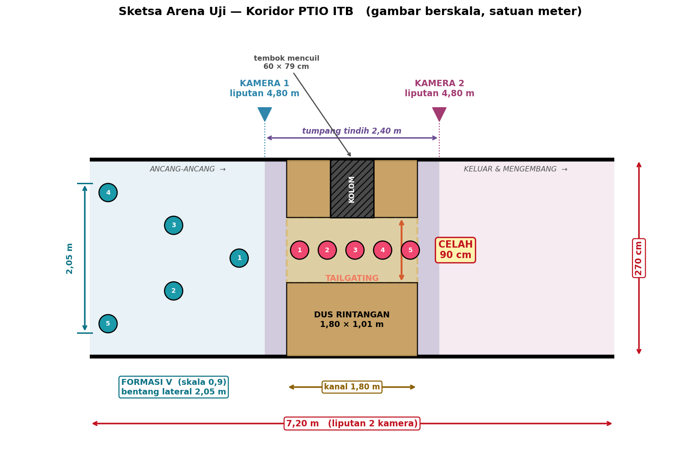

# Analisis Kelayakan Lab — Hasil Pembacaan Foto & Denah

> Dibuat 2026-09-16 dari 17 foto + denah tulisan tangan di `foto/`.
> Semua ukuran ruangan bergalat ±5 cm (dinyatakan sendiri pada denah).
>
> **Diperbarui 2026-09-16 (putaran kedua):** video `video/00-video-ruangan.mp4`
> kini sudah terbaca setelah `ffmpeg` dipasang. Laporan sebelumnya keliru —
> berkasnya tidak rusak, **dekoder OpenCV yang gagal**. Temuan dari video ada di
> bagian 9, dan sebagiannya mengubah kesimpulan di bagian 1.

## 1. Ruangan

Koridor-L institusi (area pelatihan CITA ITB), **bukan ruang lab tertutup**.

| Besaran | Nilai |
|---|---|
| Tinggi plafon | **300 cm** |
| Lebar lengan lorong | **270 cm** |
| Panjang lengan | 720 cm (sisi dalam) – 960 cm (sisi luar) |
| Segmen lain | 290, 435, 480, 620 cm |
| Kolom di dalam area | 4 buah, 45–60 cm |
| Status akses | **bisa dipakai eksklusif dengan penjadwalan** |

**Plafon:** gipsum tile di rangka-T gantung. Berisi lampu TL *troffer*, *downlight*
bulat, **AC kaset**, sprinkler, detektor asap. Rangka-T hanya kuat menahan beban
ringan — dudukan kamera harus mencantol ke rel rangka atau ke struktur di atasnya,
tidak bisa disekrup ke tile.

**Cahaya:** campuran TL + *downlight* + **jendela besar** (foto 02, 04). Cahaya
matahari berubah sepanjang hari → *auto-exposure* harus dikunci manual saat
merekam data, kalau tidak deteksi tag ikut berfluktuasi.

**Lantai:** ubin abu gelap berukuran besar, memantul. Kontras bagus untuk tag
putih, tapi pantulan lampu berpotensi menimbulkan deteksi palsu.

**Catatan lain:** ada **kipas industri besar** beroda di koridor (foto 02) —
kalau itu memang rencana sumber gangguan angin, perlu dicatat spesifikasinya
karena proposal menguji ketahanan terhadap hembusan angin.

## 2. Liputan kamera — kendala yang mengikat

Plafon 300 cm, wahana setinggi 8 cm ⇒ jarak kamera–penanda hanya **1,4–1,9 m**.

Karena lebar lorong 270 cm wajib tertutup dan sensor berformat 16:9, **liputan
memanjang terkunci di 4,80 m** (= 2,70 × 16/9) **berapa pun ketinggian terbang.**
Ketinggian hanya menggeser lensa yang dibutuhkan:

| Terbang | Jarak kamera | HFOV dibutuhkan | Liputan |
|---|---|---|---|
| 1,0 m | 1,92 m | 103° | 4,80 × 2,70 m |
| 1,2 m | 1,72 m | **109°** | 4,80 × 2,70 m |
| 1,5 m | 1,42 m | 119° | 4,80 × 2,70 m |

### Rencana 2 kamera (sesuai pilihan: satu lengan penuh)

| Sasaran | Liputan 2 kamera | Tumpang tindih | Penilaian |
|---|---|---|---|
| Lengan **7,20 m** | 9,60 m | **2,40 m** | ✅ lega, aman untuk serah-terima antar kamera |
| Lengan **9,60 m** | 9,60 m | **0 m** | ❌ tanpa tumpang tindih — tidak bisa dikalibrasi jadi satu kerangka |

**KEPUTUSAN: bidik segmen 7,20 m.** Tumpang tindih 2,40 m cukup untuk
menyatukan kedua kamera ke satu kerangka acuan global dan untuk menangani
perpindahan wahana antar-liputan. Kalau 9,60 m penuh yang diinginkan, butuh
**3 kamera**, bukan 2.

## 3. Ukuran AprilTag

Pada liputan 4,80 m, dengan target 80 piksel per tag (deteksi andal saat bergerak):

| Resolusi | mm/piksel | Tag minimum | Muat di wahana? |
|---|---|---|---|
| 1080p | 2,50 | 20 cm | ❌ menutupi duct |
| 1440p | 1,88 | 15 cm | ❌ menutupi duct |
| **4K** | **1,25** | **10 cm** | ✅ |

Wahananya **cinewhoop ber-*duct*** (SpeedyBee Bee35), 25 × 21 × 8 cm. Seluruh
permukaan atas terisi duct; area datar di tengah hanya beberapa sentimeter dan
masih ditempati **modul GPS** serta strap baterai.

**Kenapa tidak boleh asal menutup duct:** propeler ber-*duct* mengisap udara dari
atas. Pelat tag yang menutup mulut duct akan menggerus daya angkat secara
langsung — bukan masalah kecil pada wahana indoor yang sudah terbatas dayanya.

**Jalan keluar yang disarankan:** kamera 4K + **lepas modul GPS** (tidak dipakai
indoor — foto 17 sudah menandainya sendiri, dan melepasnya juga mengurangi bobot)
⇒ bagian tengah bebas untuk tag ±10 cm. Printer 3D yang ada di lab bisa mencetak
dudukannya.

**Alternatif bila 4K tidak terjangkau:** pakai *tag bundle* — beberapa tag kecil
yang disusun kaku pada titik-titik datar yang tersedia. Gabungan beberapa tag
kecil memberi pose lebih baik daripada satu tag kecil tunggal.

## 4. Spesifikasi belanja kamera

| Syarat | Nilai | Alasan |
|---|---|---|
| Resolusi | 3840 × 2160 (4K) | agar tag 10 cm cukup piksel |
| FPS | ≥ 30 pada 4K (60 lebih baik) | wahana bergerak |
| HFOV | ±109° | menutup lebar lorong 270 cm |
| Rana | **global shutter** diutamakan | *rolling shutter* memelintir pose saat wahana bergerak |
| Antarmuka | USB3 | 4K@30+ tidak muat di USB2 |
| Jumlah | **2 unit** | satu lengan 7,2 m |

⚠️ **RAB perlu direvisi.** Anggaran sekarang Rp1.500.000 untuk **satu** kamera.
Rencana ini butuh **dua**, dan 4K global shutter kemungkinan besar di atas
Rp1,5 juta per unit. Angka barunya harus dipastikan dari harga pasar sebelum
Tabel RAB dan subbab Biaya diperbarui — **jangan menebak angka.**

## 5. Inventaris perangkat keras

| Barang | Temuan |
|---|---|
| Airframe | **6 unit**: 2 siap terbang, 2 setengah jadi (duct terpasang, propeler belum), 2 rangka kosong — cukup untuk 5 agen |
| Wahana | SpeedyBee Bee35 cinewhoop, 25 × 21 cm, tinggi 8 cm dengan baterai |
| Flight controller | **SpeedyBee F405 Mini** (STM32F405, ICM-42688P, barometer DSP-310) |
| ESC | SpeedyBee **BLS 35A Mini** 4-in-1 (BLHeli_S) |
| Companion computer | **Seeed Studio XIAO ESP32-S3** — sangat mungil, GPIO terbatas |
| Baterai | Campur: 4× 1200 mAh, 2× 1500, 1× 2200, 2× Gens Ace 5000 |
| Lain-lain | Propeler cadangan, duct cadangan, kartu program Turnigy, **printer 3D + filament** |
| GPS | Modul terpasang di atas wahana — **tidak dipakai indoor, sebaiknya dilepas** |

## 6. 🔴 Penghalang arsitektur: FC tidak bisa menerima posisi eksternal

**Ini temuan paling penting dari sesi ini.**

ArduPilot memang resmi mendukung papan ini (target `SpeedyBeeF405Mini`, hanya
Copter yang dibuild). **Tetapi** STM32F405 hanya punya 1 MB flash, dan ArduPilot
membuang fitur agar muat. Dari daftar fitur resmi build stabilnya
(`firmware.ardupilot.org/Copter/stable/SpeedyBeeF405Mini/features.txt`):

```
!EK3_FEATURE_EXTERNAL_NAV     DISABLED   ← navigasi eksternal EKF3
!HAL_VISUALODOM_ENABLED       DISABLED   ← odometri visual
!AP_BEACON_ENABLED            DISABLED   ← masukan beacon (jalur UWB)
!HAL_NAVEKF2_AVAILABLE        DISABLED
!AP_OPTICALFLOW_ENABLED       DISABLED
```

Dokumentasi ArduPilot juga menyatakan navigasi non-GPS "requires a board with
more than 1MB of flash" dan "only supported by EKF3 (not EKF2)".

**Artinya:** ArduPilot bawaan pada papan ini **tidak bisa menerima**
`VISION_POSITION_ESTIMATE` dari kamera atas. Perhatikan `AP_BEACON_ENABLED` juga
mati — jadi **jalur UWB pun ikut tertutup** pada papan ini. Ini bukan soal
kamera-lawan-UWB, melainkan keterbatasan flash papannya.

### Tiga jalan keluar

| Jalan | Isi pekerjaan | Risiko | Biaya |
|---|---|---|---|
| **A. Build ArduPilot sendiri** | Aktifkan `EK3_FEATURE_EXTERNAL_NAV` lewat `--extra-hwdef`, matikan fitur lain agar muat 1 MB | Firmware racikan sendiri, kurang teruji; perlu menyiapkan lingkungan build waf + toolchain ARM | Rp0 |
| **B. Ganti FC ke F7/H7 (≥2 MB)** | Pakai papan yang fiturnya lengkap, mis. kelas H743 | Paling kecil risikonya, jalur paling standar untuk riset indoor non-GPS | 5 × papan baru |
| **C. Kalang posisi di companion computer** | FC tetap Betaflight/INAV sebagai penstabil sikap; ESP32-S3 menjalankan kalang posisi & kecepatan, mengirim perintah sikap lewat MSP/CRSF | Paling dekat dengan arsitektur yang sudah digambarkan proposal, tapi EKF & kalang posisi harus ditulis sendiri di ESP32-S3 | Rp0 |

### ✅ Keputusan: jalan A, lewat Custom Firmware Builder

Dipilih **jalan A**, dan ternyata jauh lebih ringan dari dugaan awal: ArduPilot
menyediakan **Custom Firmware Builder berbasis web** (<https://custom.ardupilot.org>)
yang dibuat persis untuk papan 1 MB — *"this will give a path to enable a user to
select which features will or will not be included, giving some flexibility to
users of 1MB autopilots."*

**Tidak perlu toolchain ARM maupun waf.** Cukup: pilih Copter → versi →
`SpeedyBeeF405Mini`, centang `EK3_FEATURE_EXTERNAL_NAV`, matikan fitur tak
terpakai agar muat, Generate, unduh `.apj`, flash lewat Mission Planner
("Load custom firmware").

Langkah rinci dan rencana cadangan ada di `docs/keputusan/KP02-firmware-fc.md`.
Bila build tidak muat, jatuh ke **jalan C**, bukan jalan B.

**Catatan untuk jalan C:** proposal sudah menggambarkan pembagian tugas
*companion computer* = perencana tingkat tinggi, FC = penstabil tingkat rendah.
Jalan C hanya menggeser batas itu satu lapis ke bawah. Tetapi XIAO ESP32-S3
sangat terbatas GPIO-nya, dan harus menanggung sekaligus: Wi-Fi/UDP, EKF, kalang
posisi-kecepatan, 2 sensor ultrasonik, dan logika ERC. Beban ini perlu diukur,
bukan diasumsikan.

## 7. Yang masih terbuka

| # | Hal | Status |
|---|---|---|
| 1 | **Firmware yang terpasang sekarang** di FC (Betaflight bawaan pabrik?) | belum terjawab — yang disebut baru nama papannya. Tidak menghalangi, karena akan di-flash ulang dengan build racikan |
| 2 | **Harga pasar kamera 4K** untuk merevisi RAB (2 unit, bukan 1) | perlu survei harga sebelum Tabel RAB diperbarui — jangan menebak angka |
| 3 | **Lebar celah rintangan** dari dus | harus diselaraskan dengan rasio lebar-celah : lebar-wahana yang dipakai simulator. Wahana nyata 25 cm; koridor sim 1,0 m |
| 4 | **Sumber gangguan angin** | kipas industri di koridor akan **dipindahkan**, jadi bukan sumber angin. Uji ketahanan angin belum punya alat — perlu direncanakan terpisah atau klaimnya dibatasi ke simulasi saja |
| 5 | **Dudukan kamera di plafon rangka-T** | perlu dipastikan boleh mencantol ke rel rangka; beban harus ringan |
| 6 | **Video ruangan** | tidak terbaca (frame hitam, `ffmpeg` tidak terpasang). Kalau isinya penting, pasang `ffmpeg` atau kirim tangkapan layar |

## 8. Keputusan yang sudah diambil

| Keputusan | Berkas |
|---|---|
| Lokalisasi: kamera atas + AprilTag, UWB opsional bersyarat | `docs/keputusan/KP01-lokalisasi-apriltag.md` |
| Firmware FC: ArduPilot racikan lewat Custom Firmware Builder | `docs/keputusan/KP02-firmware-fc.md` |
| Area terbang: segmen lurus 7,20 m, 2 kamera, tumpang tindih 2,40 m | bagian 2 di atas |
| Kamera: 4K, HFOV ±109°, ≥30 FPS, global shutter diutamakan, 2 unit | bagian 4 di atas |
| Ruangan: bisa dipakai eksklusif dengan penjadwalan | bagian 1 di atas |

---

## 9. Temuan dari video (putaran kedua)

Rekaman 53,6 detik, 420×743, menyusuri area. Menunjukkan hal yang tidak terlihat
pada foto diam.

### 9.1 Ruangannya penuh perabot

| Perabot | Letak | Dampak |
|---|---|---|
| **Deretan sofa panjang** (4–5 unit, berbantal guling) | menempel satu dinding sepanjang lorong | **memakan ±80–90 cm lebar lorong** |
| 3–4 **roll-up banner** | berjajar di dinding & kolom | penghalang tegak, mudah roboh kena *downwash* |
| Bangku kerja oranye + peralatan | area terbuka | |
| Sekat rotan, kursi, jam dinding, dispenser | tersebar | |
| **Kipas industri besar** beroda | menempel dinding | akan dipindahkan |
| **Kipas berdiri biru** | dekat banner | **kandidat sumber angin** — belum dikonfirmasi |
| Pintu kayu berengsel | membuka **ke dalam** area | penghalang bergerak + soal keselamatan |
| Orang | terlihat duduk di area | perlu penjadwalan |

### 9.2 Plafon: rangka-T ubin 60 × 60 cm

Terlihat jelas pola ubin gantung berukuran standar. Ini **menguntungkan**:
rangkanya jadi kisi ukur bawaan sekaligus pola pemasangan yang teratur untuk
menempatkan dua kamera pada jarak yang diketahui.

Tapi banyak posisi ubin sudah terpakai: **AC kaset**, *downlight* bulat, sprinkler,
dan *troffer* TL. Kedua titik kamera harus direncanakan menghindari semua itu.

### 9.3 Pencahayaan campur aduk

Terlihat **tiga jenis sumber sekaligus**: *troffer* TL berona kehijauan,
*downlight* hangat, dan **kaca *clerestory*** di atas dinding sekat yang
meneruskan cahaya dari ruang sebelah. Ujung lorong bahkan berona **merah muda**
— sumber cahaya lain lagi.

⇒ **Auto-exposure dan auto-white-balance wajib dikunci manual** saat merekam data.
Kalau dibiarkan otomatis, kecerahan berubah saat wahana berpindah antar zona
cahaya dan deteksi tag ikut terganggu.

### 9.4 Lantai berubin besar

Nat ubin membentuk kisi teratur — berguna untuk **menandai posisi dus rintangan
secara berulang** antar sesi, tanpa perlu mengukur ulang tiap kali.

## 10. Penskalaan skenario: simulator → arena nyata

Dibaca langsung dari kode simulator (`Agent/MultiAgentConfig.py`,
`Environment/Obstacles.py`):

| Besaran | Simulator | Keterangan |
|---|---|---|
| Diameter agen | 0,40 m | `ROBOT_RADIUS = 0.2` |
| Topologi V 5 agen | lateral ±1,0 m, memanjang ±1,0 m | `TOPOLOGY`, `FORMATION_TYPE = 1` |
| Bentang formasi | **2,40 × 2,40 m** | termasuk diameter agen |
| Celah sempit (scheme2) | **1,00 m** | dinding y=3,0 dan y=4,0 pada x=10–15 |
| Panjang bagian sempit | 5,00 m | |
| Panjang koridor | 20,0 m | |

Wahana nyata berdiameter **0,25 m**, jadi faktor skala **k = 0,625**.

### Skenario nyata yang menjaga rasio simulator

| Besaran | Nilai terskala |
|---|---|
| Bentang formasi | **1,50 × 1,50 m** |
| **Celah sempit** | **0,62 m** |
| Panjang bagian sempit | 3,12 m |
| Lebar bersih dibutuhkan | **2,10 m** (bentang + 30 cm tiap sisi) |
| Panjang dibutuhkan | **7,12 m** (sempit 3,12 + ancang 2,0 + keluar 2,0) |

### Kecocokan dengan lab

| Syarat | Tersedia | Putusan |
|---|---|---|
| Panjang 7,12 m | 7,20 m (liputan 2 kamera) | ✅ **cukup, sisa 8 cm** |
| Lebar 2,10 m — lorong kosong | 2,70 m | ✅ cukup |
| Lebar 2,10 m — **sofa tetap di tempat** | ±1,80 m | ❌ **kurang 30 cm** |

## 🔴 Konsekuensi: sofa harus dipindahkan

Ini syarat yang mengikat, bukan preferensi. Dengan deretan sofa di tempatnya,
lebar bersih tinggal ±1,80 m sementara skenario menuntut 2,10 m. Formasi V
terskala tidak akan muat, sehingga **pemicu ERC tidak akan pernah terjadi secara
sah** — wahana sudah terpaksa berbanjar sejak awal, bukan karena mendeteksi celah.

Karena ruangan **bisa dipakai eksklusif dengan penjadwalan**, memindahkan sofa
saat sesi uji seharusnya bisa diatur. Perlu dipastikan ke pengelola.

Catatan: celah 0,62 m menyisakan hanya **18,5 cm per sisi** saat wahana mengekor.
Itu ketat untuk kendali nyata. Bila terlalu berisiko, celah boleh dilebarkan ke
0,80 m (27,5 cm per sisi) — konsekuensinya rasio celah/agen naik dari 2,5 ke 3,2,
**tidak lagi setara dengan simulator**, dan perbedaan itu wajib dinyatakan saat
membandingkan hasil fisik dengan hasil simulasi.

---

## 11. Rancangan arena (final)



Dibuat oleh `sketsa_arena.py` — jalankan ulang bila geometri berubah.

**Keputusan yang mengubah rancangan sebelumnya:**

- **Kipas tidak dipakai.** Uji gangguan angin dibatasi ke simulasi. Diperiksa dan
  **tidak menuntut revisi naskah**: Ruang Lingkup dan Hipotesa tidak pernah
  menjanjikan uji angin fisik; angin hanya muncul sebagai elemen simulasi
  (baris 508 naskah).
- **Sofa dan banner disingkirkan** → lebar bersih penuh **2,70 m** tersedia.
- **Celah dilebarkan** dari 0,62 m (skala ketat 0,625) menjadi **0,90 m**, dan
  ditempatkan di tengah bentang pada **kolom yang mencuil** (60 × 79 cm).

| Besaran | Nilai | Catatan |
|---|---|---|
| Skala formasi | **k = 0,9** | maksimum yang muat: 2k + 0,25 + 0,60 ≤ 2,70 ⟹ k ≤ 0,925 |
| Bentang lateral formasi V | **2,05 m** | sisa 32,5 cm per sisi |
| Celah | **0,90 m** | sisa **32,5 cm per sisi** saat mengekor — jauh lebih aman dari 18,5 cm |
| Kedalaman dus | **1,01 m** | = 2,70 − 0,79 (kolom) − 0,90 (celah) |
| Panjang kanal | 1,80 m | kolom 60 cm + perpanjangan dus 60 cm tiap sisi |
| Rasio bentang/celah | **2,28** | simulator 2,40 — cukup dekat, pemicu ERC tetap sah |

Kolom dipakai sebagai **satu sisi celah** karena permanen dan kaku: posisinya
tidak bergeser antar sesi, sehingga geometri rintangan dapat direproduksi tanpa
mengukur ulang. Dus hanya melengkapi sisi seberangnya.

⚠️ **Perbedaan yang wajib dinyatakan saat membandingkan dengan simulasi:** panjang
bagian sempit di simulator, bila diskalakan, seharusnya 4,5 m; arena nyata hanya
1,80 m. Fase mengekor di dunia nyata karenanya jauh lebih singkat. Jalan keluar
yang lebih bersih: **tambahkan skema baru di simulator yang meniru geometri arena
ini**, sehingga simulasi dan perangkat keras benar-benar sebanding — bukan
memaksakan arena meniru `scheme2`.

⚠️ **Jumlah dus perlu dicek.** RAB merencanakan 10 dus. Dinding dus setinggi
minimal ketinggian terbang (±1,2 m) sepanjang 1,80 m, ditambah perpanjangan di
sisi kolom, kemungkinan melebihi 10 dus. Hitung ulang setelah ukuran dus diketahui.
